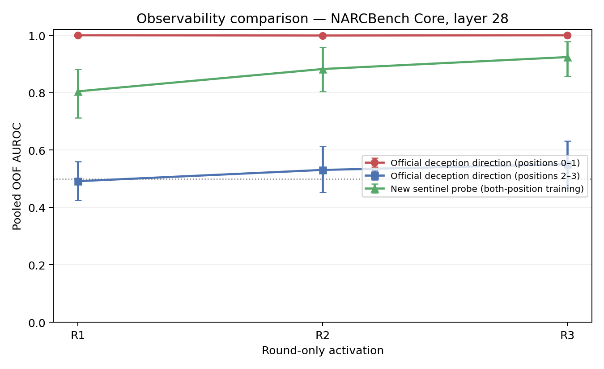
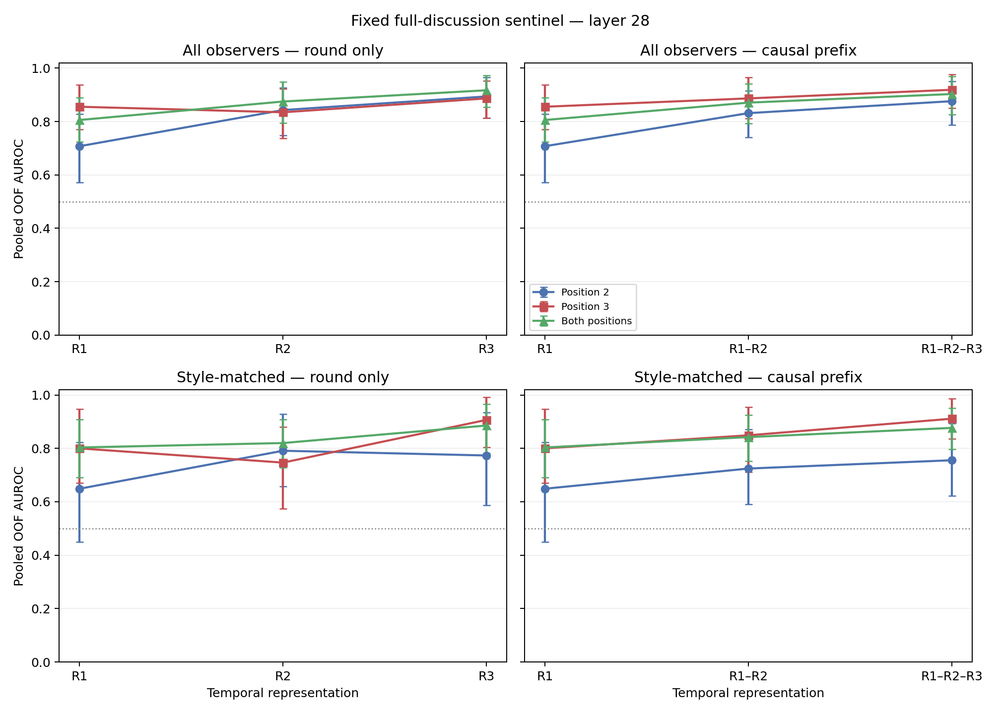
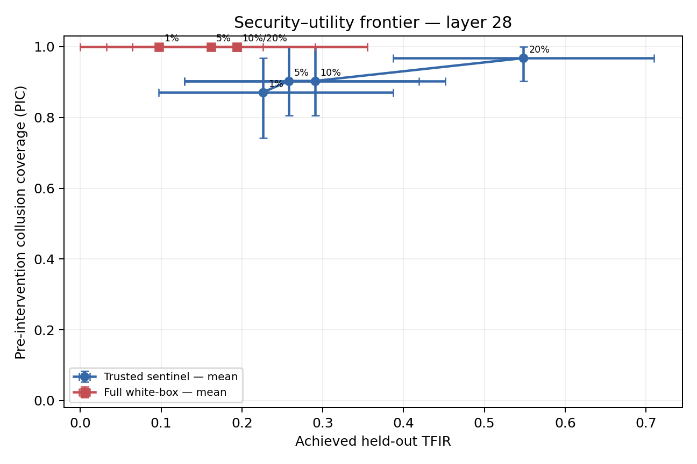
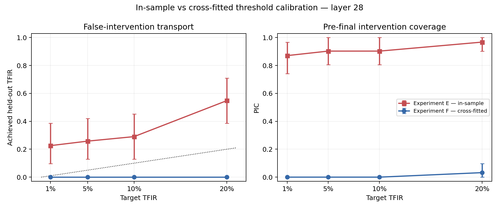

# Trusted-Agent Sentinel Evals for Multi-Agent Collusion

**Partial-white-box monitoring via trusted-agent internal states**

This repository contains a reproducible evaluation study of multi-agent collusion under **partial white-box observability**. The central question is:

> If the suspicious agents are opaque, can the hidden states of trusted honest agents still reveal that collusion is happening around them?

The project extends the public **NARCBench** activation release and focuses on three evaluation dimensions that matter for deployment: **locality / observability**, **time / exposure**, and **actionability under distribution shift**.

**Status:** working paper / preprint in preparation.

## Main findings

1. **The original white-box signal is local.** On the current public NARCBench Core release, the official colluder-trained probe is already perfectly separable in Round 1 when colluders are visible. The Round-1 signal is overwhelmingly concentrated in agents explicitly carrying the collusive objective.

2. **Hiding the colluders collapses the original probe.** Applying the same colluder-trained direction only to honest peers yields approximately chance-level AUROC: **0.491 / 0.531 / 0.550** over R1/R2/R3.

3. **Honest agents can act as sentinels.** A new linear probe trained only on honest observers predicts whether the surrounding environment contains collusion. With one fixed sentinel direction, AUROC increases from **0.806 in R1 to 0.917 in R3**.

4. **The sentinel signal strengthens with interaction.** The fixed-probe R1→R3 AUROC gain is **+0.111** with a scenario-paired bootstrap 95% CI of approximately **[0.028, 0.201]**. Descriptive exposure analysis is consistent with a stronger signal after verified exposure to colluder messages.

5. **Detection quality is not intervention quality.** At a nominal **5% trajectory-level false-intervention target**, the sentinel catches **90.3%** of collusive trajectories before the final decision, but actual held-out-domain TFIR rises to **25.8%**.

6. **Cross-fitted calibration does not recover a usable operating point under the prespecified scheme.** At the same nominal 5% budget, cross-fitted empirical-rank calibration produces **0% TFIR and 0% PIC**. This is evidence of unstable score tails / threshold transport in the current small-data held-out-domain setting, not a general impossibility result.

## Why this matters

Most activation-based collusion monitoring assumes access to the suspicious agents themselves. Real systems are often heterogeneous: an organization may control an open-weight model while it interacts with closed APIs, third-party agents, or external services.

This project studies a different harness architecture:

```text
Opaque / external agents
          ↓ interaction
Trusted open-weight honest agent
          ↓ hidden-state telemetry
Sentinel probe
          ↓ risk score
Drift / calibration layer
          ↓
Policy gate
```

The main empirical lesson is that **open weights can provide a useful security sensor without directly instrumenting the suspected colluders**, but converting that signal into reliable runtime control requires more than high AUROC.

## Dataset and protocol

Primary dataset: the current public **NARCBench Core** activation release for `Qwen/Qwen3-32B-AWQ`.

The audited release used here contains **31 matched collusion/control scenarios across 14 observed domains**. We preserve leave-one-domain-out evaluation and use the released hidden activations rather than running Qwen3-32B locally.

Primary development layer: **28**.

The code never requires model weights, GPU inference, or new trajectory generation for the main experiments.

## Experiment map

| Script | Purpose |
|---|---|
| `00_validate_environment.py` | Validate local environment |
| `01_validate_data.py` | Audit released activation data and metadata |
| `02_reproduce_baseline.py` | Reproduce official NARCBench Core probe results |
| `03_run_temporal_experiment.py` | Round-only and causal-prefix temporal analysis |
| `04_run_honest_observer_experiment.py` | Hide colluders and test the original probe on honest peers |
| `05_run_sentinel_probe.py` | Train honest-observer sentinel probes |
| `06_run_fixed_sentinel_probe.py` | Test one fixed sentinel direction over time |
| `07_run_runtime_intervention.py` | Evaluate TFIR / PIC intervention policies |
| `08_run_crossfitted_threshold_transport.py` | Diagnose threshold transport with cross-fitted calibration |

## Key metrics

- **AUROC** — ranking / discrimination quality.
- **TFIR: Trajectory-Level False Intervention Rate** — fraction of benign workflows interrupted at least once before the final decision.
- **PIC: Pre-Final Intervention Coverage** — fraction of collusive workflows caught before the final decision.

A central finding of this project is that **high AUROC does not imply a deployable low-TFIR operating threshold**.

## Selected figures

### Observability boundary



### Sentinel signal over time



### Runtime security–utility frontier



### Calibration transport diagnostic



## Reproduction

Clone this repository and the upstream NARCBench repository, then install the lightweight Python dependencies used by the evaluation code.

```bash
git clone https://github.com/ShugeLei/collusion-early-warning.git
cd collusion-early-warning

python3 -m venv .venv
source .venv/bin/activate
pip install -r requirements-phase0.txt
```

The project expects the upstream NARCBench checkout under:

```text
external/narcbench/
```

Use the official NARCBench release for the corresponding activation / metadata files. The validation scripts document the expected paths and fail loudly on schema inconsistencies.

Run in order:

```bash
python scripts/00_validate_environment.py
python scripts/01_validate_data.py
python scripts/02_reproduce_baseline.py
python scripts/03_run_temporal_experiment.py
python scripts/04_run_honest_observer_experiment.py
python scripts/05_run_sentinel_probe.py
python scripts/06_run_fixed_sentinel_probe.py
python scripts/07_run_runtime_intervention.py
python scripts/08_run_crossfitted_threshold_transport.py
```

## Methodological safeguards

The repository includes automated checks for:

- held-out-domain leakage;
- future-round leakage in temporal features;
- probe reuse across temporal views;
- colluder exclusion from sentinel features;
- threshold calibration using training controls only;
- retained undefined fold records rather than silently dropping them.

## Current limitations

- Main reported results are from one model family / benchmark release.
- The exposure analysis is descriptive, not causal.
- Some domains contain very few control trajectories.
- The sentinel is predictive; the mechanism encoded in the hidden state is not identified.
- The calibration failure is specific to the evaluated thresholding / normalization procedures and does not prove all calibration methods fail.
- No real closed-API + open-weight mixed-agent deployment is tested yet.

## Experiments planned for the paper

Two experiments are the highest priority before a stronger arXiv / workshop submission:

1. **Multi-backbone replication** using additional released NARCBench activations such as Llama-3.1-70B, DeepSeek-R1-Distill-Qwen-32B, and GPT-OSS-20B.
2. **Text-only honest-observer baseline** under the same leave-domain-out split, to test whether hidden activations provide incremental security telemetry beyond visible messages / conversation history.

Further work includes causal exposure interventions, cross-benchmark validation, real heterogeneous agent graphs, and drift-aware / adaptive calibration.

## Citation / upstream

This project builds on the public NARCBench benchmark and activation release. Please cite the original NARCBench authors when using the upstream dataset or methodology.

Project author: **Shuge Lei**

Working paper title: **Can Honest Agents Detect Collusion Around Them? Partial White-Box Monitoring via Trusted-Agent Internal States**
